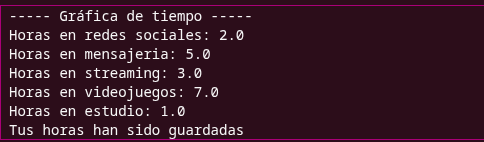
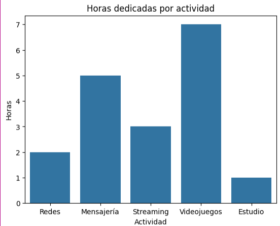
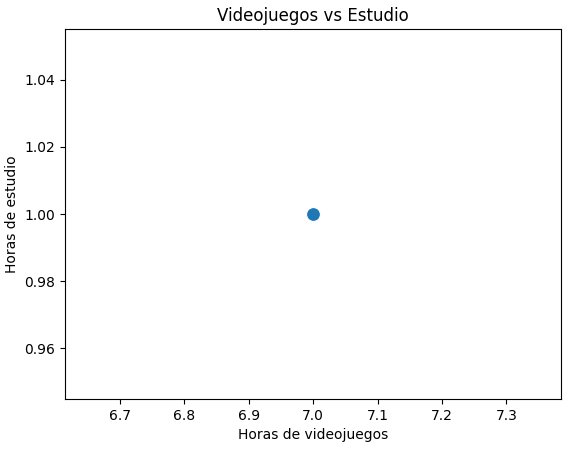
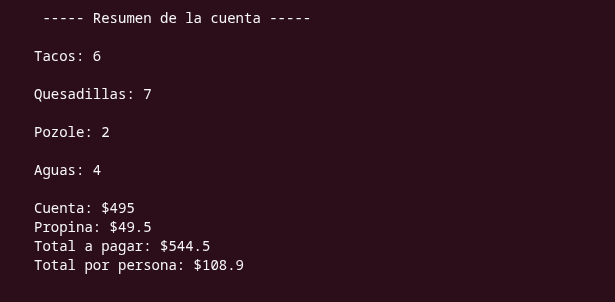
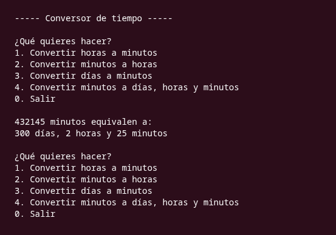
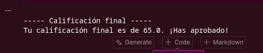
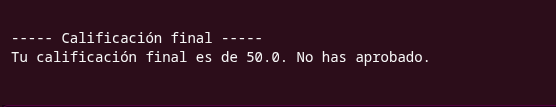

# Actividad 1 Evaluable — Calculadora de tiempo digital

**Curso:** Solución de problemas con programación computacional
**Semana:** 1 - Temas 1 al 4

---

## 1. Descripción del reto

Desarrollar una **calculadora interactiva en Python** que permita registrar el tiempo diario (en horas o fracciones de hora) que una persona dedica a distintas plataformas digitales: redes sociales, mensajería, servicios de streaming, videojuegos, entre otras. El programa debe capturar los datos, procesarlos y mostrar un resumen claro y ordenado de los resultados.

Este reto utiliza el modelo **Entrada-Proceso-Salida**, la lógica algorítmica en **pseudocódigo y PSeInt**, el uso correcto de **variables, tipos de datos y operadores** y las **entradas y salidas simples** con `input()`, `print()` y conversión de tipos.

---

## 2. Requerimientos técnicos 

1. **Nombre del usuario:** Solicitar el nombre del usuario mediante la función `input()`.
2. **Mínimo cinco plataformas:** Solicitar el tiempo diario dedicado a **al menos cinco** plataformas digitales diferentes (ej. redes sociales, mensajería, streaming, videojuegos, estudio en línea).
3. **Tiempos parciales:** Emplear la función `float()` para permitir el ingreso de tiempos parciales (ej. `1.5` horas).
4. **Tiempo total:** Calcular la suma del tiempo total diario invertido en actividades digitales.
5. **Porcentaje del día:** Calcular el porcentaje del día (24 horas) utilizado en actividades digitales mediante la fórmula:
   `porcentaje = (tiempo_total / 24) * 100`
6. **Salida ordenada:** Mostrar en pantalla, de forma ordenada y formateada (f-strings), el **nombre del usuario**, el **tiempo total acumulado** y el **porcentaje calculado**.

## Implementación adicional

**Implementación de graficas**: Se usaron gráficas con `matplotlib` y `seaborn` para hacer una comparativa de horas registradas por el usuario, tales gráficas como tipo `pie`, `barplot` y `scatterplot`

# Actividad evaluable

```python
import matplotlib.pyplot as plt
import seaborn as sns


print("----- Gráfica de tiempo -----")

user = str(input("Ingresa tu nombre: "))
redes = float(input("Horas en redes sociales: "))
mensajeria = float(input("Horas en mensajería: "))
streaming = float(input("Horas en streaming: "))
videojuegos = float(input("Horas en videojuegos: "))
estudio = float(input("Horas en estudio: "))

print(f"Usuario: {user}")
print(f"Horas en redes sociales: {redes}")
print(f"Horas en mensajeria: {mensajeria}")
print(f"Horas en streaming: {streaming}")
print(f"Horas en videojuegos: {videojuegos}")
print(f"Horas en estudio: {estudio}")


# actividades
actividades = [
    "Redes",
    "Mensajería",
    "Streaming",
    "Videojuegos",
    "Estudio"
]

# Horas
horas = [
    redes,
    mensajeria,
    streaming,
    videojuegos,
    estudio
]

if sum(horas) > 24:
    print("Error, no puedes superar las 24 horas en total")

elif any(hora < 0 for hora in horas):
    print("Las horas no pueden ser negativas")

else:
    print("Tus horas han sido guardadas")
```

Las siguientes lineas representan gráficas de **horas dedicadas a las plataformas**, **Distribución de tiempo** y **Una comparativa entre videojuegos y estudio** en el mismo orden.

```python
sns.barplot(
    x=actividades,
    y=horas
)

plt.title("Horas dedicadas por actividad")
plt.xlabel("Actividad")
plt.ylabel("Horas")

plt.show()


# grafica pastel 

plt.pie(
    horas,
    labels=actividades,
    autopct="%1.1f%%"
)

plt.title("Distribución de tiempo")

plt.show()

# scatterplot

sns.scatterplot(
    x=[videojuegos],
    y=[estudio],
    s=100
)

plt.title("Videojuegos vs Estudio")
plt.xlabel("Horas de videojuegos")
plt.ylabel("Horas de estudio")

plt.show()
```


A continuación se muestra un ejemplo de salida con datos introducidos por el usuario:



### Gráfica `barplot`



### Gráfica `pie`


### Gráfica `scatterplot`



# Ejercicios extras

## Ejercicio extra 1: División de cuenta con propina

Crea un programa que pida el total de la cuenta de un restaurante,
el porcentaje de propina a dejar y el número de personas que pagarán. El programa
debe calcular el monto de la propina, el total a pagar con propina y cuánto le toca
pagar a cada persona (con dos decimales)

```python
taco = 10
quesadilla = 25
pozole= 70
agua = 30

cantidad_tacos = int(input("¿Cuántos tacos consumieron? "))
cantidad_quesadillas = int(input("¿Cuántas quesadillas consumieron? "))
cantidad_pozole = int(input("¿Cuántos pozoles consumieron? "))
cantidad_agua = int(input("¿Cuántas aguas consumieron? "))

subtotal = (
    (taco * cantidad_tacos)
    + (quesadilla * cantidad_quesadillas)
    + (pozole * cantidad_pozole)
    + (agua * cantidad_agua)
)

propina = float(input("¿Deseas agregar propina? "))
personas = int(input("¿Entre cuántas personas se dividirá la cuenta? "))

monto_propina = subtotal * (propina / 100)
total = subtotal + monto_propina
por_persona = total / personas

print(f"\n ----- Resumen de la cuenta -----")
print(f"\nTacos: {cantidad_tacos}")
print(f"\nQuesadillas: {cantidad_quesadillas}")
print(f"\nPozole: {cantidad_pozole}")
print(f"\nAguas: {cantidad_agua}")
print(f"\nCuenta: ${subtotal}")
print(f"Propina: ${monto_propina}")
print(f"Total a pagar: ${total}")
print(f"Total por persona: ${por_persona}")
```

> 

## Ejercicio extra 2: Conversor de minutos a días, horas y minutos

Crea un programa que pida una cantidad total de minutos (entero) y la convierta a días, horas y minutos restantes. Utiliza los operadores de división
entera `//` y módulo `%`

```python
print("\n----- Conversor de tiempo -----")

while True:

    print("\n¿Qué quieres hacer?")
    print("1. Convertir horas a minutos")
    print("2. Convertir minutos a horas")
    print("3. Convertir días a minutos")
    print("4. Convertir minutos a días, horas y minutos")
    print("0. Salir")

    opcion = input("\nSelecciona una opción: ")

    # Horas a minutos
    if opcion == "1":

        horas = float(input("\nIngresa la cantidad de horas: "))

        minutos = horas * 60

        print(f"\n{horas} horas equivalen a {minutos} minutos")


    # Minutos a horas
    elif opcion == "2":

        minutos = float(input("\nIngresa la cantidad de minutos: "))

        horas = minutos / 60

        print(f"\n{minutos} minutos equivalen a {horas} horas")


    # Días a minutos
    elif opcion == "3":

        dias = float(input("\nIngresa la cantidad de días: "))

        minutos = dias * 24 * 60

        print(f"\n{dias} días equivalen a {minutos} minutos")


    # mintuos a días, horas y minutos restantes
    elif opcion == "4":

        minutos = int(input("\nIngresa la cantidad total de minutos: "))

        # Día en minutos: 1440 minutos
        dias = minutos // 1440

        # sobrante después de sacar los días
        minutos_restantes = minutos % 1440

        # Convertir los minutos restantes en horas
        horas = minutos_restantes // 60

        # minutos sobrantes después de sacar las horas
        minutos_finales = minutos_restantes % 60

        print(f"\n{minutos} minutos equivalen a:")
        print(f"{dias} días, {horas} horas y {minutos_finales} minutos")


    # para salir
    elif opcion == "0":

        print("\n Cerrando programa")
        break


    # Opción incorrecta
    else:

        print("\nOpción no válida. Prueba de nuevo.")
```
> 

## Extra 3: Calificación final ponderada
Crea un programa que pida las calificaciones de tres parciales
(valores de 0 a 10) y calcule la calificación final considerando una ponderación de
**30%, 30% y 40%** respectivamente. Muestra el resultado con dos decimales.

```python
print("\n----- Calificación final -----")

parcial1 = float(input("Parcial 1 (30%): "))
parcial2 = float(input("Parcial 2 (30%): "))
parcial3 = float(input("Parcial 3 (40%): "))

calificacion_final = (
    (parcial1 * 0.30)
    + (parcial2 * 0.30)
    + (parcial3 * 0.40)
)

if calificacion_final >= 60:
    print(f"Tu calificación final es de {calificacion_final}. ¡Has aprobado!")

else:
    print(f"Tu calificación final es de {calificacion_final}. No has aprobado. ")
```
> Salida si es mayor a 60: 


> Salida si es menor a 60:
> 

## Extra 4: Conversor de moneda (MXN a USD y EUR)
Crea un programa que pida una cantidad en pesos mexicanos y los
tipos de cambio del dólar (USD) y del euro (EUR). Debe calcular y mostrar las
equivalencias redondeadas a dos decimales. (Fórmula: `cantidad / tipo_de_cambio`.)

```python
print("\n----- Conversor de moneda -----")

# tipo de cambio
tipo_cambio_usd = 18.50
tipo_cambio_eur = 21.00

cantidad_mxn = float(input("Cantidad en MXN: "))

# conversiones
usd = cantidad_mxn / tipo_cambio_usd
eur = cantidad_mxn / tipo_cambio_eur

print(f"\n${cantidad_mxn} MXN equivalen a:")
print(f"USD: ${usd}")
print(f"EUR: €{eur}")
```

> 

