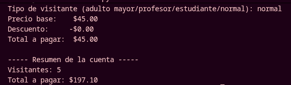
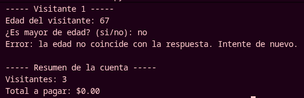
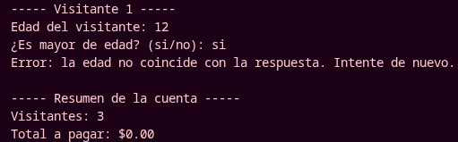

# Actividad 2 Evaluable  — Cobro de Entradas del Museo con Restricciones de Control

---

## Introducción

En esta actividad se desarrolla un programa en **Python** para cobrar las entradas de los visitantes del **Museo de Antropología e Historia**. El sistema calcula el precio adecuado para cada visitante aplicando descuentos por tipo de visitante bajo condiciones lógicas estrictas.

Este reto integra las estructuras de decisión `if/elif/else` y operadores lógicos (Tema 5), el ciclo `while` con `break` y `continue` (Tema 6), la depuración con PDB (Tema 7) y el ciclo `for` con acumuladores (Tema 8).

**Precios base de entrada:**

| Tipo de visitante | Precio |
| :--- | :---: |
| Niños menores de 3 años | Gratis ($0) |
| Menores de edad (3 a 17 años) | $30 |
| Mayores de 18 años | $45 |

**Tabla de descuentos:**

| Tipo de visitante | Descuento |
| :--- | :---: |
| Adulto mayor | 12% |
| Profesor | 10% |
| Estudiante | 10% |

---

## Definiciones

Se definieron constantes para los precios base según la categoría de edad y los porcentajes de descuento aplicables.
```python
sin_pago = 0       # Menores de 3 años
precio_menor = 30  # De 3 a 17 años
precio_adulto = 45 # Mayores de 18 años

# Porcentajes de descuento
descuento_adulto_mayor = 0.12
descuento_profesor = 0.10
descuento_estudiante = 0.10
```

---

## Captura del n de visitantes

El programa solicita al usuario el total de visitantes que pagarán boleto, el cual se convierte a entero para controlar el ciclo `for` que procesa a cada persona.

```python
num_visitantes = int(input("¿Cuántos visitantes van a pagar boleto? "))
```

---

## Ciclo de procesamiento con break y continue

Se utiliza un ciclo `for` con `range(num_visitantes)` para recorrer a cada visitante. Dentro del ciclo se capturan la edad, la confirmación de mayoría de edad y el tipo de visitante.

### Uso de `continue`

Cuando el visitante es menor de 3 años, el boleto es gratis ($0). Se imprime un mensaje y se ejecuta `continue` para saltar al siguiente visitante sin calcular descuento ni cobro.

```python
if edad < 3:
    print("Menor de 3 años, sin cargo")
    continue
```

### Uso de `break`

Se valida que la edad coincida con la respuesta de mayoría de edad. Si hay incoherencia (por ejemplo, 20 años y responde "no", o 15 años y responde "si"), se ejecuta `break` para detener el proceso, ya que los datos no son lógicos.

```python
if edad >= 18 and mayor_edad == "no":
    print("Error: la edad no coincide con la respuesta. Intente de nuevo.")
    break

if edad < 18 and mayor_edad == "si":
    print("Error: la edad no coincide con la respuesta. Intente de nuevo.")
    break
```

---

## Tabla de descuentos

La estructura `if/elif/else` nos asegura que **solo se aplique un tipo de descuento por boleto**. Primero se determina el precio base según la edad y luego se evalúa el tipo de visitante para aplicar el descuento correspondiente.

```python
if edad <= 17:
    precio_base = precio_menor
else:
    precio_base = precio_adulto

descuento = 0
if tipo_visitante == "adulto mayor":
    descuento = precio_base * descuento_adulto_mayor
elif tipo_visitante == "profesor":
    descuento = precio_base * descuento_profesor
elif tipo_visitante == "estudiante":
    descuento = precio_base * descuento_estudiante
```

De esta forma, si un visitante es adulto mayor, solo recibe el 12% y no se le aplica ningún otro descuento. La estructura con `elif` asegura que solo una condición se cumpla.

---

## Print general

Por cada visitante se muestra el desglose: precio base, monto de descuento y total a pagar. Al finalizar, el ciclo se imprime el total general acumulado.

```python
precio_final = precio_base - descuento
total_general += precio_final

print(f"Precio base:    ${precio_base:.2f}")
print(f"Descuento:     -${descuento:.2f}")
print(f"Total a pagar:  ${precio_final:.2f}")
```

```python
print("\n----- Resumen de la cuenta -----")
print(f"Visitantes: {num_visitantes}")
print(f"Total a pagar: ${total_general:.2f}")
```

## Salidas esperadas 

Para probar la funcionalidad del programa, se hizo la prueba con 5 visitantes, verificando cada uno de los tipos de descuento

### Salida general



También, para comprobar el uso de `break` se hizo la prueba con contradicciones de edades

En la siguiente imagen de salida se muestra un ejemplo de contradicción de edades, donde el usuario determina el valor del visitante con **67** y su respuesta es que **el visitante es menor de edad** 




Ahora se muestra una salida donde es inverso; el usuario determina el valor **12** y su respuesta es que **el visitante es mayor de edad**


---

# Ejercicios Extras 

## Extra 1: Control de aforo con break y continue (while)

utiliza un ciclo `while` infinito que acumule el costo de los boletos. Si el boleto es gratis ($0), se imprime un mensaje y se ejecuta `continue` para saltar al siguiente visitante. Si el acumulador supera o iguala $100, se ejecuta `break` para detener el ciclo.

```python
total_acumulado = 0
numero_boleto = 1

while True:
    costo = int(input(f"Costo del boleto {numero_boleto}: "))

    if costo == 0:
        print("Menor de 3 años, sin cargo")
        numero_boleto += 1
        continue

    total_acumulado += costo
    print(f"Boleto {numero_boleto} ${costo} registrado. Acumulado: ${total_acumulado}")
    numero_boleto += 1

    if total_acumulado >= 100:
        print("Cuota alcanzada, se detendrá el registro")
        break

print(f"Total acumulado: ${total_acumulado:.2f}")
```


---

## Extra 2: Estadística de visitantes con for

Pide el número total de visitantes y utiliza un ciclo `for` con `range` para capturar la edad de cada uno. Utiliza un acumulador para contar adultos (>=18 años) y otro para sumar las edades, calculando el promedio al final.

```python
num_visitantes = int(input("Número de visitantes: "))

total_adultos = 0
suma_edades = 0

for i in range(num_visitantes):
    edad = int(input(f"Edad del visitante {i + 1}: "))
    suma_edades += edad
    if edad >= 18:
        total_adultos += 1

promedio = suma_edades / num_visitantes

print(f"Adultos: {total_adultos}")
print(f"Promedio de edad: {promedio:.2f}")
```


---

## Extra 3: Depuración de un cobro con PDB

El código original asigna `descuento = 12` (un entero), pero el descuento debe ser un porcentaje (0.12). Al restar `precio - 12` se obtiene 33 en vez de 39.60. Se identifica el error usando `pdb.set_trace()` para inspeccionar las variables y luego se corrige.

```python
import pdb

precio = 45
descuento = 12  # error aquí: debe ser el porcentaje 0.12, no el entero 12
total = precio - descuento
print(f"Total (con error): ${total:.2f}")

print("Error lógico: el descuento debe ser en porcentaje 0.12, no 12.")

descuento_corregido = precio * 0.12
total_corregido = precio - descuento_corregido
print(f"Código corregido: descuento = precio * 0.12 -> Total: ${total_corregido:.2f}")
```


---

## Extra 4: Pirámide de asteriscos con for

 Se pide la altura de la pirámide. Con un ciclo `for` externo se controlan las filas (de 1 a altura). Con un ciclo `for` interno imprimen los asteriscos de cada fila usando `end=""` para evitar salto de línea, y luego se imprime una línea vacía para avanzar de fila.


```python
altura = int(input("Altura de la pirámide: "))

for fila in range(1, altura + 1):
    for col in range(fila):
        print("*", end="")
    print()
```

